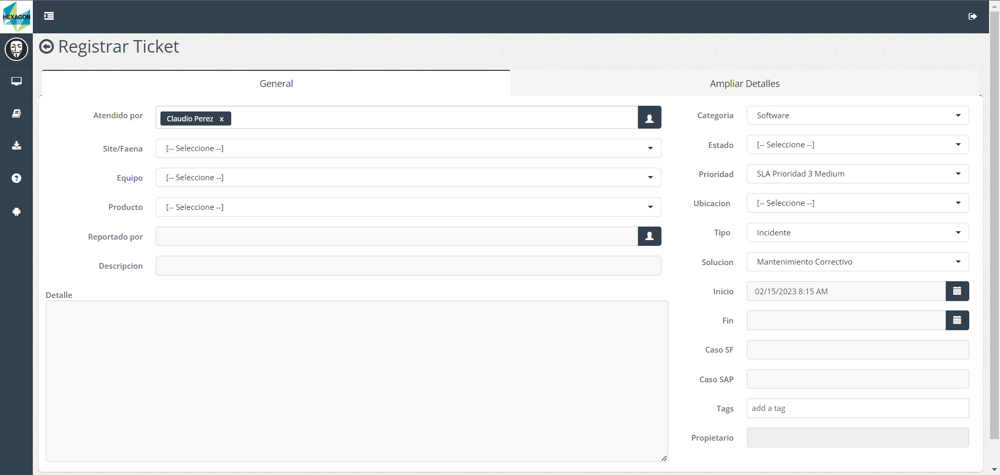

# Registro de Tickets Hexagon

Created time: February 15, 2023 8:02 AM
Last edited time: February 15, 2023 8:21 AM

# Inicializar el proyecto

1. Debemos tener Python instalado →  [Download Python](https://www.python.org/downloads/)

1. En la ruta creamos el entorno virtual: 

```python
python -m venv .venv
```

1. Abrir el directorio con tu editor de preferencia, en mi caso VSCode → [VSCode](https://code.visualstudio.com/download)

1. Instalar los paquetes requeridos: 

```python
pip install -r requirements.txt
```

1. Crear el archivo “.env” y agregar las credenciales, ejemplo: 

```bash
username = "user@test.com"
password = "passwordTest"
url = "http://url.test.com"
```

1. Formato Excel: 

| fecha | faena | equipo | producto | reportado por | descripcion | detalle | estado | ubicacion | tipo | solucion | hora_ini | hora_fin | hora_ini_t | hora_fin_t |
| --- | --- | --- | --- | --- | --- | --- | --- | --- | --- | --- | --- | --- | --- | --- |

---

Este script esta pensado en automatizar el ingreso de datos en el formulario a través de un formato Excel diseñado para el mismo utilizando Selenium y WebDriver Manager.



Quizás falte mejorar todavía más el script, cualquier sugerencia/corrección es bien recibida.